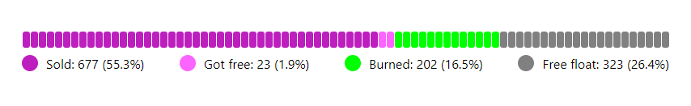

# ProgressBar component

## input props
1. Data array :
[
{name: 'Sold', color: '#BD1FBE', value: 677},
{name: 'Got free', color: '#FC64FF', value: 23},
...
]
2. height - number, bar line height
3. width - number, bar line width

0-value bars are not displayed, non-zero values always have not less than 1 bar (bars amount is an integer)

### This is what the component looks like  

